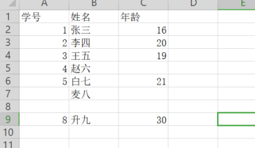

# EasyCSV

## 入门和安装
### 简介
######    EasyCSV是一个方便易上手的Java开发工具，用于简化开发人员操作CSV文件时操作流程，包括对CSV文件的读和写两大功能。作者开发目的主要用于读取大数据量的Csv文件，灵感来源EasyExcel，也是通过重写监听器的方式读取数据，当然也支持一次性全量读入。
### 安装
######    由于作者能力有限，目前EasyCSV只支持jar包的方式引入项目，当然您也可以选择把EasyCSV的项目代码引入到您的项目中。jar包位置在easy-csv/target/EasyCSV-1.0-SNAPSHOT.jar。
### 作者简介
######    王毅谦，一名99年的后端开发，爱摸鱼，爱划水。 邮箱：885690863@qq.com  QQ:885690863 有问题欢迎讨论~
## 快速上手
### 读取
###### 通过EasyCsv对csv文件的读取有两种方式：一种是全量读，一次性将csv文件中的所有数据读入到内存中；另一种方式是监听器读，用户可以通过重写监听器的方式读取CSV文件，更加灵活自由。
#### 全量读取readAll
###### 1、准备样例数据

###### 2、创建读取实体类
```java
public class Student{
        @CsvProperty("学号")
        private int no;
        @CsvProperty("姓名")
        private String name;
        @CsvProperty("年龄")
        private Integer age;
        @IgnoreField //忽略CSV列与java实力类映射注解
        private Integer testFileld;

        public int getNo() {
            return no;
        }

        public void setNo(int no) {
            this.no = no;
        }

        public String getName() {
            return name;
        }

        public void setName(String name) {
            this.name = name;
        }

        public Integer getAge() {
            return age;
        }

        public void setAge(Integer age) {
            this.age = age;
        }

        @Override
        public String toString() {
            return "Student{" +
                    "no=" + no +
                    ", name='" + name + '\'' +
                    ", age=" + age +
                    ", testFileld=" + testFileld +
                    '}';
        }
    }
 ```
###### 3、调用API
```java
public void testReadAll(){

        List<Student> students = new EasyCsv().readAll("C:\\Users\\it\\Documents\\WXWork\\1688857922266493\\Cache\\File\\2022-04\\测试.csv"
                , Student.class);
        System.out.println(students);
    }
```
#### 监听器读取doRead（主要用于处理大型CSV文件）
###### 1、准备样例数据并创建读取实体类：此处样例数据和java实例类用上面的代码。
###### 2、重写监听器
```java
package test;

import com.xykj.easycsv.listener.CsvListener;

import java.util.ArrayList;
import java.util.List;
import java.util.Map;

public class StudentListener implements CsvListener<Student> {


    public List<Student> dataList=new ArrayList<>();


    /**
     *
     * @param data  实例化后的对象
     * @param sourceColumn 源数据行字符串
     */
    @Override
    public void invoke(Student data, String sourceColumn) {
        dataList.add(data);
    }

    /**
     * 初始化标题
     * @param titleIndexMap
     * @param sourceColumn
     */
    @Override
    public void invokeHead(Map<String, Integer> titleIndexMap, String sourceColumn) {
        System.out.println(titleIndexMap);
    }

    /**
     * 当出现错误行时
     * @param e
     * @param sourceColumn
     */
    @Override
    public void onError(Exception e,String sourceColumn) {
//        System.out.println("错误行："+i+"="+sourceColumn);
    }

    /**
     * 读数据完毕
     */
    @Override
    public void readOver() {
        System.out.println("读取完毕");
    }
}

```
###### 3、执行读取方法
###### 下面代码是通过监听器读取数据的，其是监听器读主要不是像下面的样例代码中那么用，主要是用于批量读取并操作数据的时候。
```java
package test;

import com.xykj.easycsv.listener.CsvListener;

import java.util.ArrayList;
import java.util.List;
import java.util.Map;

public class StudentListener implements CsvListener<Student> {


    public List<Student> dataList=new ArrayList<>();


    /**
     *
     * @param data  实例化后的对象
     * @param sourceColumn 源数据行字符串
     */
    @Override
    public void invoke(Student data, String sourceColumn) {
        dataList.add(data);
    }

    /**
     * 初始化标题
     * @param titleIndexMap
     * @param sourceColumn
     */
    @Override
    public void invokeHead(Map<String, Integer> titleIndexMap, String sourceColumn) {
        System.out.println(titleIndexMap);
    }

    /**
     * 当出现错误行时
     * @param e
     * @param sourceColumn
     */
    @Override
    public void onError(Exception e,String sourceColumn) {
//        System.out.println("错误行："+i+"="+sourceColumn);
    }

    /**
     * 读数据完毕
     */
    @Override
    public void readOver() {
        System.out.println("读取完毕");
    }
}

```
### 写入write
###### 1、准备样例数据并创建读取实体类：此处样例数据和java实例类用上面的代码。
###### 2、执行写出方法
```java
/**
 * 写CSV测试方法
 * @param students 即将写入的数据列表
 */
public void testWrite(List<Student> students){
        String outPath="C:\\Users\\DJ033019\\Desktop\\temp\\out_test.csv";
        new EasyCsv().write(outPath,students);
        }
```

## 详细介绍
###### 未完待续